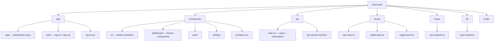

# TRACE WEB

This document defines **what this application is** and **how developers should work on it**. It covers the **product**, **tools**, **rules**, and **development flow** to ensure consistency, quality, and scalability. Please read and understand thoroughly before starting any work.

---

## Purpose

- Maintain a clean, scalable, and maintainable codebase
- Ensure consistency across features and teams
- Reduce bugs and onboarding time
- Enforce best practices for Next.js (App Router) + React Server / Client Components
- Ensure you use DRY Code
- Make sure to use the KISS method

---

> [!IMPORTANT]
> Not following these rules will make your code not to be merged. Thanks.

## Table of content

- [What Trace does](./#what-trace-does)
- [Feature surfaces & rules](./#feature-surfaces--rules)
- [Cross-cutting rules](./#cross-cutting-rules)
- [How to contribute](./#how-to-contribute)
- [Tools & Libraries](./#tools--libraries)
- [Architecture](./#architecture)
- [Workflow](./#workflow)
- [Project Infrastructure](./#project-infrastructure)
- [Auth & API Bootstrap](./#auth--api-bootstrap)
- [How to run the app](./#how-to-run)

### What Trace does

Trace is a **financial intelligence dashboard** for Nigerian creators and SMBs — a self-driving money product. The frontend in this repo talks to `trace-backend` (NestJS + Prisma + Postgres) and Anthropic's Claude API to deliver:

- A composite **financial health score** derived from real bank/transaction behavior (not credit history)
- A **weekly AI-generated summary**, **smart recommendations**, **risk & stability**, **recurring patterns**, and **anomaly** detection — all cached server-side and refreshed via a background job
- A **Copilot chat** with multi-chat support, scoped to the user's live financial snapshot, that can call tools (lookup transactions, simulate loans/investments, list recommendations)
- **Loans** gated by a tier (BRONZE → PLATINUM) derived from the same health score, with a live repayment simulator + affordability check
- **Wallet** with bank balance, sub-balance pockets, virtual cards, and money-in/out trends
- **Transactions** with category trends and a 7×24 spending heatmap
- **Investments** and **Opportunities** with detail pages, simulators, and per-product personalized rationale

The mental model: **the dashboard is the bank app. Copilot is the financial advisor sitting next to you. Loans and investments are surfaced based on what your money actually does.**

### Feature surfaces & rules

Each surface below maps to one route group under `app/app/`. The **Rule** lines call out feature-specific conventions on top of the cross-cutting rules.

#### Overview — [`app/app/overview`](./app/app/overview)

The "single glance" view: financial health card, weekly AI summary, smart recommendations, risk & stability, cash-flow chart, metric trend cards.

- **Data source:** `/analysis/*` cached insight endpoints. The backend computes on a background job (`POST /analysis/refresh`); the GETs only read cache and return `{ status: "pending" }` when empty.
- **Rule:** every card MUST handle three render states — **resolved data**, **empty / pending**, and **error**. Never let a card sit on a permanent skeleton — if the cache is `pending`, show a "no data yet" empty state instead.

#### Wallet — [`app/app/wallet`](./app/app/wallet)

Available balance, sub-balance pockets, money-in/out chart, send-to actions, virtual card preview, wallet activity table, and the Copilot summary card.

- **Rule:** monetary amounts move through the API in **kobo (integer)** — never floats. Convert only at the edge using helpers in [`lib/money.ts`](./lib/money.ts) (`formatNairaWhole`, `formatNairaCompact`, `koboToNaira`). Inline `amount / 100` is a code-review block.

#### Transactions — [`app/app/transactions`](./app/app/transactions)

Recent activity table, category trend chart, spending heatmap, transaction metrics.

- **Rule:** large lists/tables use TanStack Table in headless mode + Tailwind for styling. Keep filter/pagination state in URL search params where it makes sense so the view is shareable and refresh-safe.

#### Loans — [`app/app/loans`](./app/app/loans)

Tier ladder, "why you qualify" panel, repayment simulator (with live `/loans/affordability` calls + apply flow), repayment forecast.

- **Apply flow lives in ONE place** — the simulator card. The top-of-page "Apply now" button must scroll to the simulator anchor (`REPAYMENT_SIMULATOR_ANCHOR_ID`) rather than opening a separate form.
- **Rule:** the apply button is disabled by design when the user is not yet eligible. Always render the helper text ("Eligible after you reach SILVER tier.") next to a disabled apply button — never let the button be silently inert.

#### Investments — [`app/app/investments`](./app/app/investments) + [`[id]`](./app/app/investments/[id])

Portfolio card, safe-to-invest card, investment picks. Detail page has NAV chart, recent distributions, sector allocation, risk honest-read.

- **Rule:** any Recharts component must wrap in `<ResponsiveContainer>` and gate render on the `useMounted()` hook ([`hooks/use-mounted.ts`](./hooks/use-mounted.ts)) to avoid SSR/CSR hydration mismatches.

#### Opportunities — [`app/app/opportunities`](./app/app/opportunities) + [`[id]`](./app/app/opportunities/[id])

Categorized income opportunities with filter pills. Detail page has affordability forecast, loan summary, documents & FAQ.

- **Rule:** category filter pills derive from the data shape — do not hard-code category names in the component. New categories appear automatically when the backend adds them.

#### Copilot — [`app/app/copilot`](./app/app/copilot)

Multi-chat AI assistant scoped to the user's live financial snapshot. Backend supports chat CRUD + per-chat message CRUD; client surface lives in [`api/copilot.ts`](./api/copilot.ts).

- **Rule:** message state lives in [`stores/copilot-store.ts`](./stores/copilot-store.ts) (Zustand). `clearCopilotMessages()` wipes ALL chats; `clearCopilotChatMessages(chatId)` wipes only that chat's messages but keeps the chat row. Pick the right one.
- **Rule:** never re-implement the chat-render component per page — Copilot reuses one composer (`chat-composer.tsx`) wherever a conversation is needed.

#### Sign-up — [`app/auth/sign-up/*`](./app/auth/sign-up)

Multi-step onboarding: `account` → `profile` → `identity` → `bank` → `analysis`.

- **Buffer state** between steps persists in [`stores/sign-up-buffer-store.ts`](./stores/sign-up-buffer-store.ts) (Zustand) so a refresh mid-flow doesn't blank the form.
- **Rule:** never navigate to an earlier step by re-submitting — use the stepper's back affordance. On refresh, resume from the user's current step using `getStepIndex(...)` from [`components/auth/sign-up-steps.ts`](./components/auth/sign-up-steps.ts).

### Cross-cutting rules

These apply everywhere. They override anything a contributor might pick up from generic React/Next.js tutorials.

- **Pages compose, components contain.** A `page.tsx` is mostly imports + JSX composition. Design, fetching, and state belong inside each feature component — not in the page.
- **shadcn first.** Before building a new primitive, check [`components/ui/`](./components/ui). Only roll your own when nothing fits.
- **Motion-only animations.** All interactive animation goes through `motion/react` — never raw CSS transitions.
- **Zustand for client state, TanStack Query for server state.** Persist in `localStorage` (via the `persist` middleware) only when the state genuinely needs to survive refresh — `user-store` does, `wallet-store` does not.
- **`useEndpoint` is the data-fetching contract.** Every GET goes through it ([`hooks/use-endpoint.ts`](./hooks/use-endpoint.ts)) so every card gets the same `{ data, isLoading, error, refetch }` shape.
- **Kobo at the edges, naira at the surface.** The backend speaks kobo. Convert only when rendering to the user. Never do arithmetic in mixed units.
- **Hooks vs plain functions:** anything that uses React state/effects/store hooks goes in `hooks/`. Pure helpers (no React, no DOM) go in `lib/`.
- **Early returns + object dispatch.** Avoid long `if/else` chains; prefer object-lookup over `switch` for branching on a key.
- **`Set` / `Map` over arrays** when you need uniqueness or keyed lookup. Arrays only when position, duplicates, or `null`/`undefined` matter.
- **The token never lives on `axios.defaults`.** The request interceptor in [`api/index.ts`](./api/index.ts) reads the token from the Zustand user-store on every outgoing call. Do not bypass it.

---

### How to contribute

- Ensure to clone the project on your working computer from the GitHub repo.
- Create your own working branch from the latest `dev` branch.
- After completing your work, push and open a pull request to the `dev` branch — your request will be reviewed and merged if it meets our standards.

### Tools & Libraries

The "Why" column is the part you should read most carefully — it explains the call we made between competing options so you don't accidentally reach for a different tool that "would also work."

| #   | Package                            | Purpose                                                                | Why we chose it                                                                                                                                                                                                                | Documentation                                                                                                |
| :-- | :--------------------------------- | :--------------------------------------------------------------------- | :----------------------------------------------------------------------------------------------------------------------------------------------------------------------------------------------------------------------------- | :----------------------------------------------------------------------------------------------------------- |
| 01  | Next.js (App Router)               | Application framework + routing                                        | Server components by default keep client bundles small; the App Router gives us nested layouts, streaming, and the colocated route → layout → page model that maps cleanly onto our feature folders.                           | [https://nextjs.org/docs](https://nextjs.org/docs)                                                           |
| 02  | React 19                           | UI runtime                                                             | Required peer for Next 16; gives us the new `use()` hook and improved transitions which we lean on for non-blocking updates.                                                                                                   | [https://react.dev](https://react.dev)                                                                       |
| 03  | TypeScript                         | Type system                                                            | Catches API/DTO drift between the frontend and `trace-backend` at compile time. **No** new `.js` files — everything is `.ts` / `.tsx`.                                                                                         | [https://www.typescriptlang.org/docs/](https://www.typescriptlang.org/docs/)                                 |
| 04  | Tailwind CSS v4                    | Styling                                                                | Utility-first removes the "where do I put this style?" debate. v4 is CSS-first (no `tailwind.config.js`) which keeps tokens collocated with `globals.css`.                                                                     | [https://tailwindcss.com/docs](https://tailwindcss.com/docs)                                                 |
| 05  | shadcn/ui                          | Component scaffolding                                                  | We **own** the source of every UI primitive rather than depending on a black-box library. **Always check `components/ui/` before building a new component from scratch.**                                                       | [https://ui.shadcn.com](https://ui.shadcn.com)                                                               |
| 06  | Radix UI / @base-ui/react          | Accessible primitives                                                  | These ship under the shadcn components and give us accessibility (focus, ARIA, keyboard) for free. Don't roll your own modal/menu/popover.                                                                                     | [https://www.radix-ui.com](https://www.radix-ui.com)                                                         |
| 07  | Class Variance Authority (CVA)     | Component variants                                                     | Encodes prop → class mappings declaratively so variants live with the component, not in `className` ternaries.                                                                                                                 | [https://cva.style/docs](https://cva.style/docs)                                                             |
| 08  | tailwind-merge + clsx              | Class composition                                                      | `cn()` in `lib/utils.ts` uses these to safely merge conflicting Tailwind classes from `className` props.                                                                                                                       | [https://github.com/dcastil/tailwind-merge](https://github.com/dcastil/tailwind-merge)                       |
| 09  | Motion (`motion/react`)            | Animations                                                             | **All animation goes through `motion/react`** — never raw CSS transitions. Single API, deterministic, supports layout/spring animations the design uses.                                                                       | [https://motion.dev/docs/react](https://motion.dev/docs/react)                                               |
| 10  | Zustand                            | Client state                                                           | Light, hook-first, no provider boilerplate. The persisted `user-store` survives refresh; ephemeral stores (wallet, copilot, sign-up buffer) live alongside it. **Zustand is the canonical client store — do not add Redux.** | [https://zustand.docs.pmnd.rs/](https://zustand.docs.pmnd.rs/)                                               |
| 11  | TanStack Query                     | Server state                                                           | Cache, dedupe, and lifecycle of remote data. We wrap it in [`hooks/use-endpoint.ts`](./hooks/use-endpoint.ts) so every fetcher gets the same `data / isLoading / error` contract.                                              | [https://tanstack.com/query/latest](https://tanstack.com/query/latest)                                       |
| 12  | TanStack Table                     | Headless table primitives                                              | Headless = we keep full styling control with Tailwind while it handles sort/filter/pagination logic.                                                                                                                           | [https://tanstack.com/table/latest](https://tanstack.com/table/latest)                                       |
| 13  | Axios                              | HTTP client                                                            | Interceptors are the killer feature — request interceptor reads the token from Zustand on every call, response interceptor maps 401 → `clearStore()`. See [`api/index.ts`](./api/index.ts).                                    | [https://axios-http.com/](https://axios-http.com/)                                                           |
| 14  | React Hook Form                    | Form state                                                             | Uncontrolled-by-default = fewer rerenders on input changes. Works hand-in-hand with `@hookform/resolvers`.                                                                                                                     | [https://react-hook-form.com](https://react-hook-form.com)                                                   |
| 15  | Joi (via `@hookform/resolvers`)    | Form validation                                                        | Schema-first validation that runs on submit; co-located with each form's hook.                                                                                                                                                 | [https://joi.dev/](https://joi.dev/)                                                                         |
| 16  | Sonner                             | Toasts                                                                 | Tiny, accessible, queue-aware. Mounted once in `app/layout.tsx` — call `toast.success(...)` from anywhere.                                                                                                                     | [https://sonner.emilkowal.ski](https://sonner.emilkowal.ski)                                                 |
| 17  | Recharts                           | Charts                                                                 | Composable SVG charts. Wrap in `ResponsiveContainer` and gate render on `useMounted()` to avoid SSR/CSR mismatch.                                                                                                              | [https://recharts.org](https://recharts.org)                                                                 |
| 18  | Embla Carousel                     | Carousels                                                              | Headless and small. Plays well with our Tailwind / shadcn style.                                                                                                                                                               | [https://www.embla-carousel.com](https://www.embla-carousel.com)                                             |
| 19  | React Day Picker                   | Date picker                                                            | Used inside the shadcn `<Calendar />`. Don't reach for a different date-picker library.                                                                                                                                        | [https://daypicker.dev](https://daypicker.dev)                                                               |
| 20  | date-fns                           | Date helpers                                                           | Tree-shakeable, no Moment-style mutation traps. Use this for all date formatting/arithmetic.                                                                                                                                   | [https://date-fns.org](https://date-fns.org)                                                                 |
| 21  | Lucide React                       | Icons                                                                  | Consistent line-icon set that matches the design system. Don't mix in icons from other libraries.                                                                                                                              | [https://lucide.dev](https://lucide.dev)                                                                     |
| 22  | next-themes                        | Theme (light/dark) switch                                              | Persists choice in `localStorage`, exposes the `useTheme()` hook used by `<ThemeToggle />`.                                                                                                                                    | [https://github.com/pacocoursey/next-themes](https://github.com/pacocoursey/next-themes)                     |
| 23  | tw-animate-css                     | Pre-baked animation utilities                                          | Used inside the shadcn primitives for entrance/exit. Don't author one-off CSS keyframes in components — use this or Motion.                                                                                                    | [https://www.npmjs.com/package/tw-animate-css](https://www.npmjs.com/package/tw-animate-css)                 |
| 24  | ESLint + `eslint-config-next`      | Code quality check                                                     | Enforces the Next.js rules + project lint rules. **`npm run lint` must be clean before opening a PR.**                                                                                                                         | [https://eslint.org/](https://eslint.org/)                                                                   |
| 25  | Prettier + Tailwind plugin         | Code formatting                                                        | One opinionated style; the plugin auto-sorts Tailwind class lists so diffs stay clean.                                                                                                                                         | [https://prettier.io/](https://prettier.io/)                                                                 |

### Architecture

This chapter explains how the project is structured and why it is structured that way.

#### Architectural Diagram

```text
trace-web/
├── app/                         # Next.js App Router — pages, layouts, route groups
│   ├── (demo)/                  # Component preview route group (does not ship to nav)
│   ├── app/                     # Authenticated dashboard route group
│   │   ├── overview/
│   │   ├── investments/
│   │   ├── opportunities/
│   │   ├── loans/
│   │   ├── wallet/
│   │   ├── transactions/
│   │   ├── copilot/
│   │   └── layout.tsx           # Dashboard shell, gated by withAuth()
│   ├── auth/                    # Sign-in / sign-up flows
│   └── layout.tsx               # Root layout — ThemeProvider, Providers, Toaster
│
├── components/
│   ├── ui/                      # shadcn primitives — owned source, edited in place
│   ├── auth/                    # Auth-flow components (sign-in / sign-up steps)
│   ├── dashboard/               # Dashboard feature components, grouped by domain
│   │   ├── copilot/
│   │   ├── investments/
│   │   ├── loans/
│   │   ├── opportunities/
│   │   ├── transactions/
│   │   └── wallet/
│   ├── landing/                 # Public marketing page components
│   └── providers.tsx            # Client-side QueryClient + auth bootstrap
│
├── api/                         # Axios client + per-domain fetchers
│   ├── index.ts                 # axios instance + interceptors
│   ├── analysis.ts
│   ├── auth.ts
│   ├── copilot.ts
│   ├── investments.ts
│   ├── loans.ts
│   ├── opportunities.ts
│   ├── transactions.ts
│   └── wallet.ts
│
├── stores/                      # Zustand stores (persisted where useful)
│   ├── user-store.ts
│   ├── wallet-store.ts
│   ├── copilot-store.ts
│   └── sign-up-buffer-store.ts
│
├── hooks/                       # Custom React hooks (React-dependent globals)
│   ├── use-endpoint.ts
│   ├── use-mobile.ts
│   └── use-mounted.ts
│
├── lib/                         # Pure helpers — no React, no side effects
│   ├── utils.ts                 # cn() helper
│   ├── functions.ts             # General utilities
│   ├── money.ts                 # Kobo ↔ Naira formatting
│   ├── enum.ts                  # Shared enums mirrored from the backend
│   ├── regex.ts
│   ├── validation.ts
│   └── variables.ts
│
└── public/                      # Static assets served as-is
```

#### Data & Responsibility Flow

```text

Page (app/.../page.tsx)
  ↓ (composes)
Feature Component (components/dashboard/<domain>/...)
  ↓ (consumes)
useEndpoint(key, fetcher)  ←——  Zustand store (client state)
  ↓
api/<domain>.ts (typed fetcher)
  ↓
axios instance (api/index.ts)
  ↓
trace-backend (NestJS)
```

#### Architecture Overview (Mermaid)



#### Folder Responsibilities

| Folder                       | Purpose                                                                                                                          |
| ---------------------------- | -------------------------------------------------------------------------------------------------------------------------------- |
| `app/`                       | Next.js App Router. Each folder is a route; `layout.tsx` files wrap children; `page.tsx` is the leaf.                            |
| `app/app/`                   | Authenticated dashboard. Wrapped in `withAuth(...)` — redirects to sign-in if no `userDetails`.                                  |
| `app/auth/`                  | Public sign-in / sign-up flows. Multi-step onboarding lives here.                                                                |
| `components/ui/`             | shadcn-generated primitives. **Source is owned by this repo — edit in place when needed.**                                       |
| `components/<feature>/`      | Feature-scoped components grouped by domain (`dashboard/loans`, `dashboard/wallet`, etc.). Design + logic live inside each one. |
| `api/`                       | Axios client and typed per-domain fetchers. One file per backend module.                                                         |
| `stores/`                    | Zustand stores. Persist only what genuinely needs to survive refresh (e.g. `user-store`).                                        |
| `hooks/`                     | Custom React hooks for React-dependent globals.                                                                                  |
| `lib/`                       | Pure helpers — no React, no side effects, no module-load DOM access.                                                             |
| `public/`                    | Static assets served at the site root.                                                                                           |

> [!NOTE]
> This architecture follows a **feature-first composition model**.
> Pages **compose** — they import feature components and arrange them.
> Components **contain** — design + state + behavior live inside the component, not the page.

### Workflow

- Create a separate branch from the latest updated `dev` to contribute.
- Ensure you run `npm run lint` and `npm run typecheck` before pushing your branch — both must be clean.
- Ensure you run `npm run format` to keep diffs free of whitespace noise.
- Remove every `console.log` before pushing.
- Use the dev server (`npm run dev`) to smoke-test the feature you changed AND the surrounding flows you might have regressed.
- Ensure you communicate with your team members if any blockage occurs so they can render any help needed.
- Memorize expensive components / values / callbacks (`useMemo`, `useCallback`, `React.memo`) to prevent unnecessary rerenders.

### Project Infrastructure

#### File & code conventions

- **All file names are `kebab-case`.** No `MyComponent.tsx` — it's `my-component.tsx`.
- **One component per file.** The component name is `PascalCase`; the file is the kebab-case version.
- **Pages compose, components contain.** A `page.tsx` should be mostly imports + JSX composition. Design + data + state belong inside each component.
- **shadcn first.** Before adding a new component, check `components/ui/` — only build new if no primitive fits.
- **Animations go through `motion/react`.** Never use raw CSS transitions for interactive animation.
- **Hooks vs plain functions:** React-dependent globals (anything using `useState`, `useEffect`, store hooks, etc.) live in `hooks/`. Non-React utilities live in `lib/` as plain functions.
- **Early returns + object dispatch.** Avoid long `if/else` chains; prefer object lookup over `switch` for branching on a key.
- **`Set` / `Map` over arrays** when you need uniqueness or keyed lookup. Arrays only when position, duplicates, or null/undefined matter.
- **Client / server boundaries:** Add `"use client"` only when the component actually needs interactivity (`useState`, `useEffect`, event handlers, browser APIs). Keep wrappers like `app/layout.tsx` as server components when possible.
- **Imports:** use the `@/` alias (configured in `tsconfig.json`) — never relative paths that traverse upwards (`../../../`).

#### Path aliases

```text
@/components/...   → components/
@/api/...          → api/
@/stores/...       → stores/
@/hooks/...        → hooks/
@/lib/...          → lib/
```

#### Branches

- `main` → Production builds
- `staging` → Test builds for QA
- `dev` → Daily development

#### Naming Conventions

| Element          | Convention       | Example                            |
| ---------------- | ---------------- | ---------------------------------- |
| File Names       | kebab-case       | `wallet-balance-card.tsx`          |
| Variables        | camelCase        | `walletBalance`                    |
| Components/Types | PascalCase       | `WalletBalanceCard`                |
| Interfaces       | Start with `I`   | `IWalletBalanceProps`              |
| Types            | Start with `T`   | `TWalletBalance`                   |
| Enums            | Start with `E`   | `EWalletStatus`                    |
| Constants        | UPPER_SNAKE_CASE | `MAX_HISTORY_MESSAGES`             |
| GitHub Branches  | kebab-case       | `dasimems/wallet-balance-card`     |

#### Scripts

| Script              | Purpose                                                              |
| ------------------- | -------------------------------------------------------------------- |
| `npm run dev`       | Start the Next.js dev server with Turbopack on port `3001`.          |
| `npm run build`     | Production build.                                                    |
| `npm run start`     | Serve the production build.                                          |
| `npm run lint`      | Run ESLint (with `eslint-config-next` rules).                        |
| `npm run typecheck` | Run the TypeScript compiler in `--noEmit` mode.                      |
| `npm run format`    | Run Prettier across the codebase.                                    |

### Auth & API Bootstrap

How auth state survives a page refresh — read this before adding new pages or fetchers.

- The user `accessToken` and `userDetails` are persisted in `localStorage` by Zustand's `persist` middleware (see [`stores/user-store.ts`](./stores/user-store.ts)).
- **The token is NOT set on `axios.defaults`.** Instead, [`api/index.ts`](./api/index.ts) has a request interceptor that pulls `accessToken` from `useUserStore.getState()` on every outgoing call and sets `config.headers.set("Authorization", \`Bearer ${token}\`)`. This avoids the rehydration race where requests fired before the store finished loading would go out unauthenticated.
- On full page load, `components/providers.tsx` fires `useUserStore.getState().bootstrap()` **exactly once** (guarded by a `useRef`). If both token and userDetails are in localStorage, it revalidates against `/auth/me`; otherwise it calls `clearStore()`.
- The response interceptor maps any `401` (outside `/auth/sign-in` and `/auth/sign-up`) to `clearStore()` + a toast — so the user is bounced back to sign-in if their session dies.

> [!IMPORTANT]
> Do **not** call `bootstrap()` from individual pages. The whole point is that navigation between pages does not re-trigger the auth check.

### How to Run

Follow the steps below to run the application locally.

---

#### Prerequisites

Ensure you have the following installed:

- Node.js (v20 LTS or higher)
- Git
- pnpm (the repo ships a `pnpm-lock.yaml`) **or** npm

---

#### Environment

Create a `.env.local` at the repo root with:

```env
NEXT_PUBLIC_BASE_URL=http://localhost:3000
NEXT_PUBLIC_API_VERSION=v1
```

`NEXT_PUBLIC_BASE_URL` should point at the running `trace-backend` instance.

---

#### Install Dependencies & Run

Open your terminal and run:

```bash
pnpm install     # or: npm install
pnpm dev         # or: npm run dev
```

You should see output similar to:

```text

  ▲ Next.js 16.x.x (Turbopack)
  - Local:        http://localhost:3001
  - Environments: .env.local

 ✓ Ready in ~1.2s

```

Open `http://localhost:3001` in your browser.
